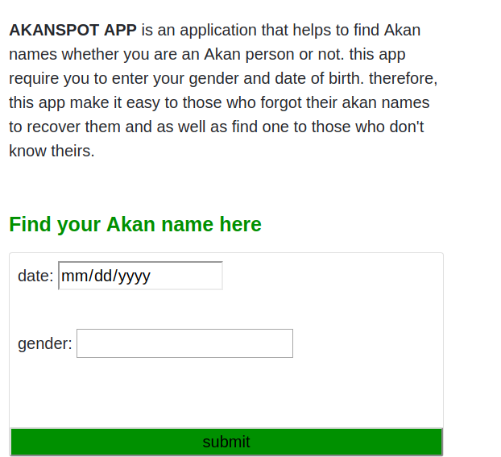

#**AKANSPOT APP**

##**_Description**_

AKANSPOT App is an application used in mobile phones, laptops, or anyother devices. it was invated based on Ghanan culuture of naming children after the day they are born. so it helps to find out a person's Akan name.

On its land page you can find there some links like ([twitter](https://twitter.com/)) where you can follow me on twitter, instagram,etc.

##**_Tools in bluiding this app_**

-Visual Studio text editor

-Google chrome browser

-Github and Git plat form

-Bootstram files.

##